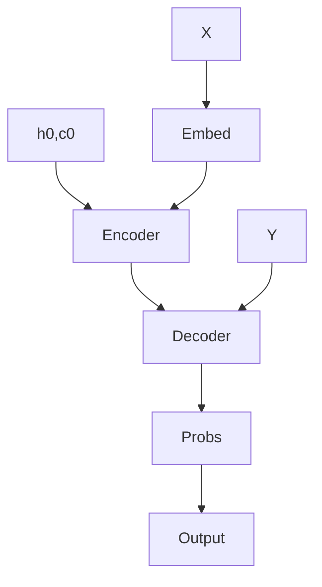

# FootyComm
Experimental LSTM + Multi-Head Attention Model + LLM decoding strategies for Football Commentary Generation 

[Deployed on Huggingface](https://huggingface.co/spaces/eshan13/FootyComm)

https://github.com/user-attachments/assets/d1b4100c-814d-488f-a01c-f04ca00f76c9

This repository contains a PyTorch implementation of a sequence-to-sequence model for football commentary generation from a structured events & stats input. The model utilizes Bi-directional LSTM along with Multi Head Self as well as Cross Attention with GPT2 as the tokenizer & is trained on football events & commentary data from european leagues. Various decoding techniques - old & recent( from LLMs) were tried out. 

## Table of Contents
- Introduction
- Setup
- Model
- Preprocessing
- Training
- Decoding
- Results

## Introduction:
It is a classic Sequence to Sequence Model with Encoder-decoder architecture with Bi-directional LSTM , but unlike using classic single head cross attention , I have experimented & implemented Multi Head Self Attention in the Encoder & Multi-Head Cross Attention in the Decoder - like Transformers . This unique combination allows the model to quickly catch on to the patterns present in Football commentary & so even with low quality & quantity of data, small model, low training epochs (~10) & Mixed precision training - the model outputs coherant commentary. Also , instead of using a Text Embedding Model - I have chosen GPT2Tokenizer for encoding text , which has a vocabulary size of 50257.

Model Architecture: 

## Setup
Test out the model at huggingface
To run the project locally: 

1.Install Python dependencies:
`pip install -r requirements.txt`

2.Clone the repository:
`git clone https://github.com/eshan1347/LSTM_sportsCommentary`

3.Download the dataset (for further training):

4.Perform Inference:
`python pred.py`

5.Run the model
`streamlit app.py`

## Model
The Encoder model is a custom pytorch model which consists of an initial embedding layer, which creates an embedding that is suitable for the gpt2, followed by a Bi-directional LSTM. Then the output is fed into a self-attention layer with 4 n_heads. The Query, Key Values are all the output from the LSTM. The attention layer allows the model to assign weights to more important parts of the input. The LSTM and attention outputs are combined and passed through 
a multi-layer perceptron. The logits - combined LSTM and attention states , hidden & cell states are returned. The decoder has the same architecture to the Encoder . The difference lies in the forward method & training.

## Preprocessing 
The dataset used is huge ~ 2 million smaples. Only 50000 entries and 35 features were utilised for training the model. Only the relevant & non-empty features were chosen.Majority of the columns were also combined to create new Columns - ex: columns home_player_name0 ... were combined to create Home & Away Team columns. The small subset of data was taken due to computation limits. The values were tokenised and encoded by the GPT2 Tokeniser and fed into the model. The Tokenization along with padding was done at a batch level inorder to reduce the padding tokens, memory & get a better result. 

## Training
A typical PyTorch training loop is ran with Adam optimizer , StepLR scheduler, early stopping and a Cross-Entropy Loss function . The entire input is passed through the Encoder to generate encoder , hidden & cell states. The hidden & cell states are used to initialise the states in the Decoder Bi-directional LSTM . The decoder is trained auto-regressively(1 step at a time) with Teacher Forcing (target tokens passed as input/ previous token to the decoder lstm) . Cross Attention with 4 n_heads is utilised with the embedded input to the decoder as query & the encoder output as the key & value. The attention output & lstm output is concatenated & returned after passing through a Output Linear layer. While applying attention - padding mask is used. 

## Decoding
After completion of training ,Experiments with various decoding techniques like greedy , sampling, top k, diverse beam search, minimum bayes risk were conducted. These techniques along with their required parameters (temperature, beam_width,  diversity penalty etc) are available to test & play around for users on the deployed huggingface space. The Best performing decoding strategy based on few test runs & vibes is Mininum Bayes Risk & the worst is greedy to no ones suprise.

## Results
The model learning can be improved by training for more epochs as well as utilising the entire dataset as well as additional data. Hyperparamter tuning & increasing the number of model parameters may also improve the results. More rigorous & complex decoding strategies like Contrastive decoding may also bring improvements.
